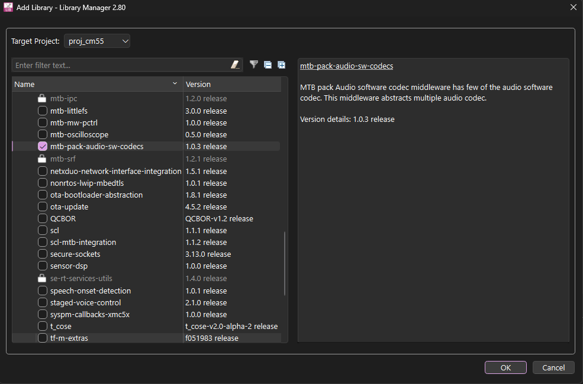
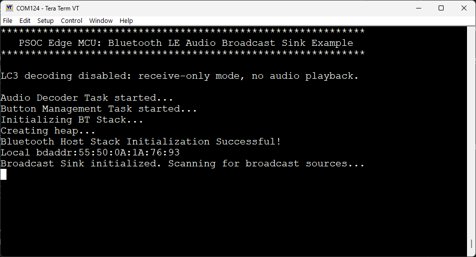
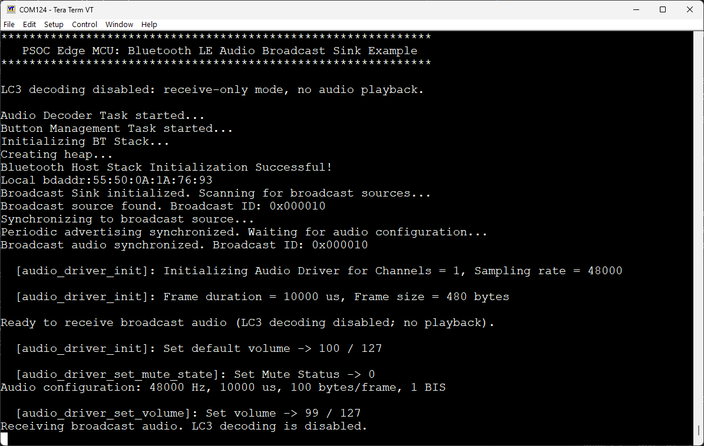
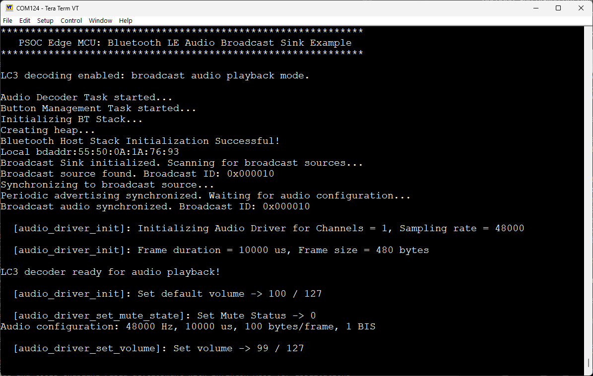

# PSOC&trade; Edge MCU: Bluetooth&reg; LE Audio Broadcast Sink

:warning: <mark style="background-color: orange">*This is an internal preview version. Example might be under development, and is not suitable for release.*</mark>

Deployed from GitLab pipeline: https://gitlab.intra.infineon.com/wpp/ce/mtb/mtb-example-psoc-edge-btstack-broadcast-sink/-/pipelines/7406155

Preview build: preview-v1.0.0.485

MTB tools version: 3.9.0.18765

BSP version (KIT_PSE84_EVAL_EPC2): 1.5.0.1211

Assets used (BSP, MW, libraries): 

**proj_cm33_s**
- async-transfer: latest-v1.X release-v1.1.1
- bt-fw-ifx-cyw55500a1: latest-v2.X release-v2.2.0
- cmsis: 6.1.1.201 latest-v6.X release-v6.1.1
- core-lib: latest-v1.X release-v1.8.0
- core-make: latest-v3.X release-v3.10.0
- device-db: latest-v4.X release-v4.41.0
- mtb-dsl-pse8xxgp: 1.8.0.1425 latest-v1.X release-v1.8.0
- mtb-ipc: latest-v1.X release-v1.2.0
- mtb-srf: latest-v1.X release-v1.2.1
- se-rt-services-utils: latest-v1.X release-v1.4.0

**proj_cm33_ns**
- async-transfer: latest-v1.X release-v1.1.1
- bt-fw-ifx-cyw55500a1: latest-v2.X release-v2.2.0
- cmsis: 6.1.1.201 latest-v6.X release-v6.1.1
- core-lib: latest-v1.X release-v1.8.0
- core-make: latest-v3.X release-v3.10.0
- device-db: latest-v4.X release-v4.41.0
- mtb-dsl-pse8xxgp: 1.8.0.1425 latest-v1.X release-v1.8.0
- mtb-ipc: latest-v1.X release-v1.2.0
- mtb-srf: latest-v1.X release-v1.2.1
- se-rt-services-utils: latest-v1.X release-v1.4.0

**proj_cm55**
- audio-codec-tlv320dac3100: latest-v1.X release-v1.1.0
- audio-voice-core: 1.0.1.480 latest-v1.X release-v1.0.1
- btstack-integration: latest-v7.X release-v7.0.2
- kv-store: latest-v2.X release-v2.2.1
- retarget-io: 1.11.0.2667 latest-v1.X release-v1.11.0
- abstraction-rtos: latest-v1.X release-v1.13.0
- async-transfer: latest-v1.X release-v1.1.1
- block-storage: latest-v1.X release-v1.4.0
- bt-fw-ifx-cyw55500a1: latest-v2.X release-v2.2.0
- btstack: latest-v5.X release-v5.0.6
- clib-support: latest-v1.X release-v1.9.0
- cmsis: 6.1.1.201 latest-v6.X release-v6.1.1
- core-lib: latest-v1.X release-v1.8.0
- core-make: latest-v3.X release-v3.10.0
- device-db: latest-v4.X release-v4.41.0
- freertos: latest-v10.X release-v10.6.203
- mtb-dsl-pse8xxgp: 1.8.0.1425 latest-v1.X release-v1.8.0
- mtb-ipc: latest-v1.X release-v1.2.0
- mtb-srf: latest-v1.X release-v1.2.1
- se-rt-services-utils: latest-v1.X release-v1.4.0

This code example demonstrates Bluetooth&reg; LE Audio Broadcast Sink functionality with PSOC&trade; Edge E84 MCU as the Bluetooth&reg; host and AIROC&trade; CYW55513 Wi-Fi & Bluetooth&reg; combo chip as the Bluetooth&reg; controller using the PSOC&trade; Edge E84 Evaluation Kit.

Using this code example, the kit becomes the Broadcast Sink device that can receive audio from a compatible Bluetooth&reg; LE Audio Broadcast Source device.

For the Broadcast Sink functionality, the application receives the encoded audio frames over the Bluetooth&reg; Isochronous Channels (ISOC). With LC3 decoding enabled, the data is decoded into audio in pulse-code modulation (PCM) format using a Low Complexity Communications Codec (LC3) codec. The PCM audio data is then transmitted to the TLV320DAC3100 hardware codec over the I2S interface for playback over the onboard speaker.

This code example has a three project structure: CM33 secure, CM33 non-secure, and CM55 projects. All three projects are programmed to the external QSPI flash and the initial boot-up sequence is executed from the external flash in Execute in Place (XIP) mode. Extended boot launches the CM33 secure project from a fixed location in the external flash, which then configures the protection settings and launches the CM33 non-secure application. Additionally, CM33 non-secure application enables CM55 CPU and launches the CM55 application. During the startup of the CM55 application, most of the code segments are copied from the external flash to internal memories to ensure faster execution.

The entire Broadcast Sink application (including the Bluetooth&reg; Host Stack, LC3 decoder, audio playback) runs on the CM55 CPU. The CM33 non-secure application does not perform any operation apart from launching the CM55 application and basic configurations before putting the CPU into DeepSleep mode.

> **Notes:**
> 1. To test the functionality of this code example, use another device acting as the Bluetooth&reg; LE Audio Broadcast Source.
> 2. This code example requires the [ModusToolbox&trade; Audio SW Codecs Tech Pack](https://softwaretools.infineon.com/tools/com.ifx.tb.tool.modustoolboxpackaudioswcodecs) to be installed for the LC3 codec library needed for decoding the received audio data. Without this technology pack, the LC3 decoding and audio playback functionalities of this code example are disabled. Refer to the [Software setup](#software-setup) section for more details.

[Provide feedback on this code example.](https://community.infineon.com)

See the [Design and implementation](docs/design_and_implementation.md) for the functional description of this code example.

## Requirements

- [ModusToolbox&trade;](https://www.infineon.com/modustoolbox) v3.9 or later (tested with v3.9)
- Board support package (BSP) minimum required version: 1.0.0
- Programming language: C
- Associated parts: All PSOC&trade; Edge E84 MCU parts

## Supported toolchains (make variable 'TOOLCHAIN')

- GNU Arm&reg; Embedded Compiler v14.2.1 (`GCC_ARM`) – Default value of `TOOLCHAIN`
- Arm&reg; Compiler v6.22 (`ARM`)
- IAR C/C++ Compiler v9.70.4 (`IAR`)
- Arm&reg; Toolchain for Embedded v22.1 (`LLVM_ARM`)

## Supported kits (make variable 'TARGET')

- [PSOC&trade; Edge E84 Evaluation Kit](https://www.infineon.com/KIT_PSE84_EVAL) (`APP_KIT_PSE84_EVAL_EPC2`) – Default value of `TARGET`
- [PSOC&trade; Edge E84 Evaluation Kit](https://www.infineon.com/KIT_PSE84_EVAL) (`APP_KIT_PSE84_EVAL_EPC4`)

## Hardware setup

This example uses the board's default configuration. See the kit user guide to ensure that the board is configured correctly.

Ensure the following jumper and pin configuration on board:
- BOOT SW must be in the HIGH/ON position
- J20 and J21 must be in the tristate/not connected (NC) position

## Software setup

See the [ModusToolbox&trade; tools package installation guide](https://www.infineon.com/ModusToolboxInstallguide) for information about installing and configuring the tools package.

To enable the complete functionality of this code example, install the [ModusToolbox&trade; Audio SW Codecs Tech Pack](https://softwaretools.infineon.com/tools/com.ifx.tb.tool.modustoolboxpackaudioswcodecs) using the the [ModusToolbox&trade; Setup](https://softwaretools.infineon.com/tools/com.ifx.tb.tool.modustoolboxsetup) program. This technology pack contains the LC3 codec required for decoding the received audio data.

Install a terminal emulator  if you do not have one. Instructions in this document use [Tera Term](https://teratermproject.github.io/index-en.html).

## Operation

See [Using the code example](docs/using_the_code_example.md) for instructions on creating a project, opening it in various supported IDEs, and performing tasks, such as building, programming, and debugging the application within the respective IDEs.

1. To enable the LC3 decoding and audio playback functionality in this example, install the [ModusToolbox&trade; Audio SW Codecs Tech Pack](https://softwaretools.infineon.com/tools/com.ifx.tb.tool.modustoolboxpackaudioswcodecs) and follow the below instructions. If this technology pack is not installed, the LC3 decoding and audio playback functionalities are disabled and the application will only receive raw data over Bluetooth&reg;

    1. Add the **Audio SW Codecs Tech Pack library** using the ModusToolbox&trade; Library Manager to the CM55 project of this code example as highlighted in **Figure 1**

       **Figure 1. Adding Audio SW Codecs Tech Pack library using ModusToolbox&trade; Library Manager**

       

   2. Set the `ENABLE_LC3_DECODING` variable to `1` in the *common.mk* file. If you do not want to install the technology pack, keep the `ENABLE_LC3_DECODING` variable to `0` (default value). In this case, the application will run without any audio playback functionality

2. Connect the board to your PC using the provided USB cable through the KitProg3 USB connector

3. Open a terminal program and select the KitProg3 COM port. Set the serial port parameters to 8N1 and 115200 baud

4. Set the desired audio configuration in the *common.mk* file using the `AUDIO_CONFIG` variable. Use the same setting on the companion source
    1. `AUDIO_CONFIG=MONO`: LC3 decoding, jitter management, and audio playback is implemented only for single channel data. The second channel data, although received over Bluetooth&reg;, is ignored. This is the default configuration
    2. `AUDIO_CONFIG=STEREO`: LC3 decoding, jitter management, and audio playback is done for two channel data

5. Clean, build and program the application on the board

6. After programming, the application starts automatically. Confirm that "PSOC Edge MCU: Bluetooth LE Audio Broadcast Sink Example" is displayed on the UART terminal

Within a few seconds, the Bluetooth&reg; Stack initialization should be successful and the Bluetooth&reg; advertisement for Broadcast Sink will be started automatically along with the terminal output printed as shown.

    **Figure 2. Terminal output on program startup**

    

7. From the other device acting as the Broadcast Source, discover and connect to this device. The Bluetooth&reg; device name of the PSOC&trade; Edge device running the Broadcast Sink application is *Broadcast Sink*

8. Once the connection is initiated, wait for a few seconds till the "Broadcast audio synchronized." message is displayed on the UART terminal as shown in **Figure 3**

   **Figure 3. Terminal output post successful Bluetooth&reg; connection**

   

9.  Now, initiate audio playback on the Broadcast Sink and Source device. On the PSOC&trade; Edge Evaluation kit, the audio should be received, decoded, and played out over the onboard speaker (if `ENABLE_LC3_DECODING` is set to `1`) and "broadcast audio playback mode" message is displayed on the UART terminal as shown in **Figure 4**

   **Figure 4. Terminal output broadcast audio playback mode**

   

 > **Notes:**
> - The code example is tested with audio of 8 kHz, 16 kHz, 24 kHz, and 48 kHz sampling rates and frame durations of 7.5 ms and 10 ms
> - For each of the sampling rate and frame duration combination, the Bluetooth&reg; connection is to be re-established for the proper configuration of the parameters

 

## Related resources

Resources  | Links
-----------|----------------------------------
Application notes  | [AN235935](https://www.infineon.com/AN235935) – Getting started with PSOC&trade; Edge E8 MCU on ModusToolbox&trade; software   [AN236697](https://www.infineon.com/AN236697) – Getting started with PSOC&trade; MCU and AIROC&trade; Connectivity devices
Code examples  | [Using ModusToolbox&trade;](https://github.com/Infineon/Code-Examples-for-ModusToolbox-Software) on GitHub
Device documentation | [PSOC&trade; Edge MCU datasheets](https://www.infineon.com/products/microcontroller/32-bit-psoc-arm-cortex/32-bit-psoc-edge-arm#documents)   [PSOC&trade; Edge MCU reference manuals](https://www.infineon.com/products/microcontroller/32-bit-psoc-arm-cortex/32-bit-psoc-edge-arm#documents)
Development kits | Select your kits from the [Evaluation board finder](https://www.infineon.com/cms/en/design-support/finder-selection-tools/product-finder/evaluation-board)
Libraries  | [mtb-dsl-pse8xxgp](https://github.com/Infineon/mtb-dsl-pse8xxgp) – Device support library for PSE8XXGP   [retarget-io](https://github.com/Infineon/retarget-io) – Utility library to retarget STDIO messages to a UART port   [btstack-integration](https://github.com/Infineon/btstack-integration) – The btstack-integration hosts platform adaptation layer (porting layer) between AIROC&trade; BTSTACK and Infineon's different hardware platforms   [kv-store](https://github.com/Infineon/kv-store) – This library provides a convenient way to store information as key-value pairs in non-volatile storage
Tools  | [ModusToolbox&trade;](https://www.infineon.com/modustoolbox) – ModusToolbox&trade; software is a collection of easy-to-use libraries and tools enabling rapid development with Infineon MCUs for applications ranging from wireless and cloud-connected systems, edge AI/ML, embedded sense and control, to wired USB connectivity using PSOC&trade; Industrial/IoT MCUs, AIROC&trade; Wi-Fi and Bluetooth&reg; connectivity devices, XMC&trade; Industrial MCUs, and EZ-USB&trade;/EZ-PD&trade; wired connectivity controllers. ModusToolbox&trade; incorporates a comprehensive set of BSPs, HAL, libraries, configuration tools, and provides support for industry-standard IDEs to fast-track your embedded application development

 

## Other resources

Infineon provides a wealth of data at [www.infineon.com](https://www.infineon.com) to help you select the right device, and quickly and effectively integrate it into your design.

## Document history

Document title: *CE243652* – *PSOC&trade; Edge MCU: Bluetooth&reg; LE Audio Broadcast Sink*

 Version | Description of change
 ------- | ---------------------
 1.0.0   | New code example
 

All referenced product or service names and trademarks are the property of their respective owners.

The Bluetooth&reg; word mark and logos are registered trademarks owned by Bluetooth SIG, Inc., and any use of such marks by Infineon is under license.

PSOC&trade;, formerly known as PSoC&trade;, is a trademark of Infineon Technologies. Any references to PSoC&trade; in this document or others shall be deemed to refer to PSOC&trade;.

---------------------------------------------------------

(c) 2026, Infineon Technologies AG, or an affiliate of Infineon Technologies AG. All rights reserved.
This software, associated documentation and materials ("Software") is owned by Infineon Technologies AG or one of its affiliates ("Infineon") and is protected by and subject to worldwide patent protection, worldwide copyright laws, and international treaty provisions. Therefore, you may use this Software only as provided in the license agreement accompanying the software package from which you obtained this Software. If no license agreement applies, then any use, reproduction, modification, translation, or compilation of this Software is prohibited without the express written permission of Infineon.
 
Disclaimer: UNLESS OTHERWISE EXPRESSLY AGREED WITH INFINEON, THIS SOFTWARE IS PROVIDED AS-IS, WITH NO WARRANTY OF ANY KIND, EXPRESS OR IMPLIED, INCLUDING, BUT NOT LIMITED TO, ALL WARRANTIES OF NON-INFRINGEMENT OF THIRD-PARTY RIGHTS AND IMPLIED WARRANTIES SUCH AS WARRANTIES OF FITNESS FOR A SPECIFIC USE/PURPOSE OR MERCHANTABILITY. Infineon reserves the right to make changes to the Software without notice. You are responsible for properly designing, programming, and testing the functionality and safety of your intended application of the Software, as well as complying with any legal requirements related to its use. Infineon does not guarantee that the Software will be free from intrusion, data theft or loss, or other breaches (“Security Breaches”), and Infineon shall have no liability arising out of any Security Breaches. Unless otherwise explicitly approved by Infineon, the Software may not be used in any application where a failure of the Product or any consequences of the use thereof can reasonably be expected to result in personal injury.
